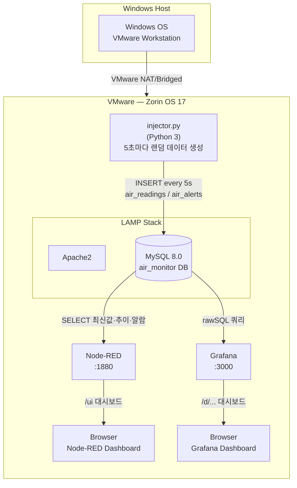
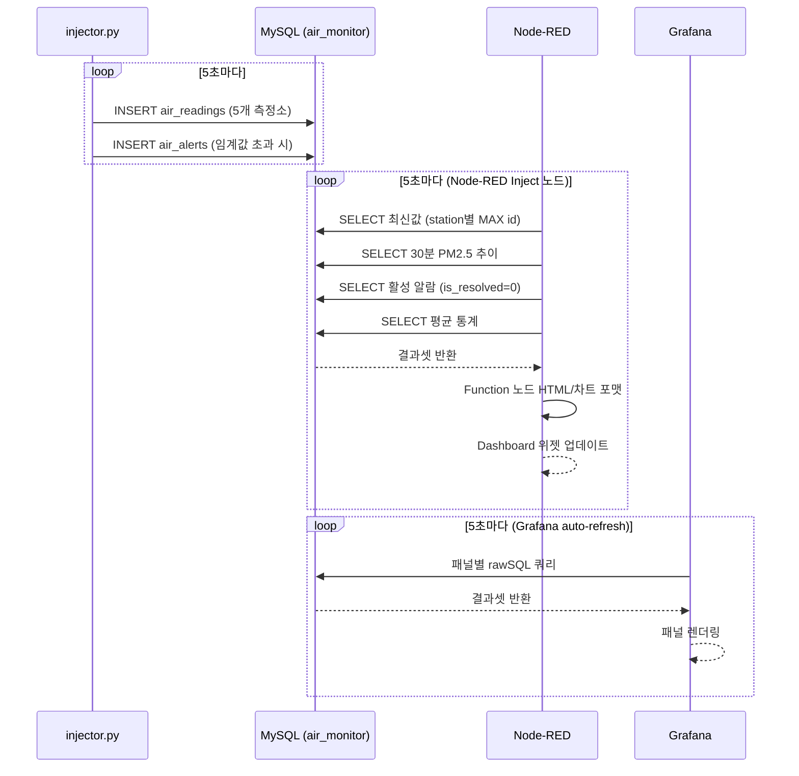
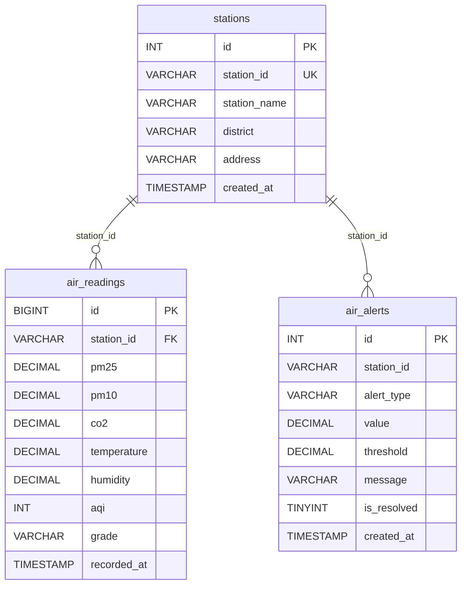
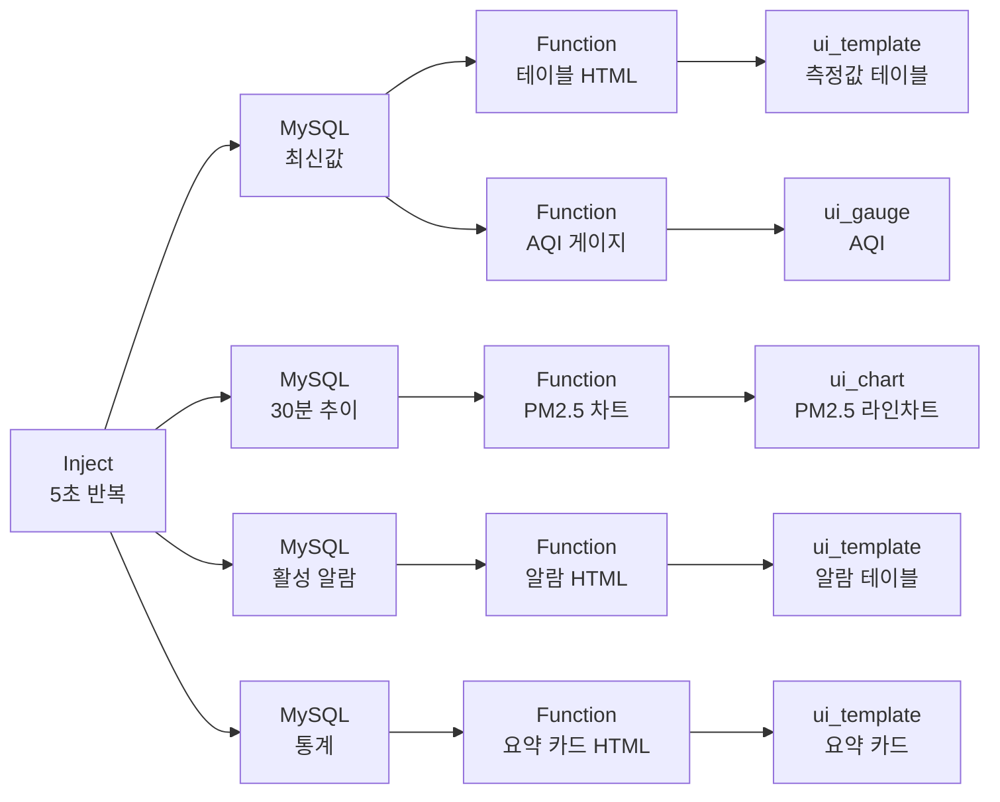

# 도시 대기질 실시간 모니터링 시스템

## 프로젝트 개요

| 항목 | 내용 |
|------|------|
| 주제 | 서울시 5개 구청 대기질 측정소의 실시간 데이터 모니터링 |
| OS | Zorin OS 17 (VMware Workstation) |
| 데이터 생성 주기 | 5초 |
| 모니터링 항목 | PM2.5, PM10, CO2, 기온, 습도, AQI |
| 모니터링 도구 | Node-RED Dashboard, Grafana |

---

## 1. 전체 시스템 블록도



---

## 2. 데이터 흐름 시퀀스



---

## 3. 데이터베이스 ERD



---

## 4. 측정소 정보

| station_id | 측정소명 | 구 | pm25_base | pm10_base | co2_base |
|------------|---------|-----|-----------|-----------|----------|
| ST-001 | 강남구 측정소 | 강남구 | 22 μg/m³ | 40 μg/m³ | 430 ppm |
| ST-002 | 종로구 측정소 | 종로구 | 30 μg/m³ | 55 μg/m³ | 470 ppm |
| ST-003 | 마포구 측정소 | 마포구 | 18 μg/m³ | 35 μg/m³ | 415 ppm |
| ST-004 | 송파구 측정소 | 송파구 | 25 μg/m³ | 45 μg/m³ | 440 ppm |
| ST-005 | 노원구 측정소 | 노원구 | 15 μg/m³ | 28 μg/m³ | 400 ppm |

---

## 5. AQI 등급 기준 (환경부)

| 등급 | PM2.5 (μg/m³) | 색상 |
|------|--------------|------|
| 좋음 | 0 ~ 15 | 초록 |
| 보통 | 16 ~ 35 | 노랑 |
| 나쁨 | 36 ~ 75 | 주황 |
| 매우나쁨 | 76 이상 | 빨강 |

---

## 6. 알람 임계값

| alert_type | 조건 | 설명 |
|------------|------|------|
| `pm25_bad` | PM2.5 ≥ 35 μg/m³ | 미세먼지 나쁨 |
| `pm25_very_bad` | PM2.5 ≥ 75 μg/m³ | 미세먼지 매우나쁨 |
| `pm10_bad` | PM10 ≥ 80 μg/m³ | 미세먼지(PM10) 나쁨 |
| `pm10_very_bad` | PM10 ≥ 150 μg/m³ | 미세먼지(PM10) 매우나쁨 |
| `co2_high` | CO2 ≥ 1000 ppm | 이산화탄소 경보 |
| `temp_high` | 기온 ≥ 35 ℃ | 고온 경보 |
| `temp_low` | 기온 ≤ -10 ℃ | 저온 경보 |

---

## 7. Node-RED Flow 구성



---

## 8. Grafana 대시보드 패널

| 패널 | 타입 | 내용 |
|------|------|------|
| 평균 PM2.5 | Stat | 전체 측정소 평균, 등급별 색상 |
| 평균 PM10 | Stat | 전체 측정소 평균 |
| 평균 CO2 | Stat | 전체 측정소 평균 |
| 활성 알람 | Stat | 미해결 알람 건수 |
| PM2.5 추이 | Time series | 최근 30분, 5개 측정소 |
| CO2 추이 | Time series | 최근 30분, 5개 측정소 |
| AQI 바 게이지 | Bar gauge | 측정소별 AQI 수평 막대 |
| 습도 게이지 | Gauge | 전체 평균 습도 |
| 최신 측정값 | Table | 5개 측정소 최신 데이터 |
| 알람 목록 | Table | 미해결 알람 최신 20건 |

---

## 9. 실행 순서

```bash
# 1. 전체 환경 설치 (최초 1회)
sudo bash ~/Desktop/sqlite_node-red/setup.sh

# 2. injector.py 백그라운드 실행
nohup python3 ~/Desktop/sqlite_node-red/python/injector.py \
      --interval 5 > /tmp/injector.log 2>&1 &

# 3. 로그 확인
tail -f /tmp/injector.log

# 4. 대시보드 접속
#   Node-RED 편집기  : http://localhost:1880
#   Node-RED UI      : http://localhost:1880/ui
#   Grafana          : http://localhost:3000  (admin/admin)

# 5. injector 종료
kill $(pgrep -f injector.py)
```

---

## 10. 파일 구조

```
sqlite_node-red/
├── setup.sh                          # 전체 환경 자동 설치
├── sql/
│   └── schema.sql                    # MySQL 스키마 (3 테이블 + 초기 데이터)
├── python/
│   └── injector.py                   # 대기질 랜덤 데이터 생성기
├── nodered/
│   └── flow.json                     # Node-RED 전체 플로우 (import용)
├── grafana/
│   ├── dashboard.json                # Grafana 대시보드 (import용)
│   └── provisioning/
│       ├── datasources/
│       │   └── mysql.yaml            # MySQL 데이터소스 자동 등록
│       └── dashboards/
│           └── dashboard.yaml        # 대시보드 프로비저닝 설정
├── project.md                        # 본 문서 (Mermaid 플로우차트 포함)
└── README.md                         # GitHub 메인 페이지
```

---

## 11. 영상 촬영 체크리스트

### 영상 1 — Node-RED 실시간 모니터링
- [ ] 터미널에서 injector.py 실행 → 콘솔 로그 확인
- [ ] `http://localhost:1880` 편집기 — flow 전체 구성 보여주기
- [ ] `http://localhost:1880/ui` 대시보드
  - 요약 카드 (PM2.5, PM10, CO2, 기온, 알람 수)
  - PM2.5 라인 차트에 데이터 추가되는 장면
  - 측정값 테이블 값 변하는 장면

### 영상 2 — Grafana 실시간 모니터링
- [ ] `http://localhost:3000` 로그인
- [ ] Configuration → Data sources → AirMonitor_MySQL → Test 성공 화면
- [ ] "도시 대기질 모니터링" 대시보드 열기
- [ ] 5초 자동 갱신 장면
  - PM2.5 Time series 데이터 추가
  - Stat 패널 값 변하는 장면
  - 알람 테이블 표시
